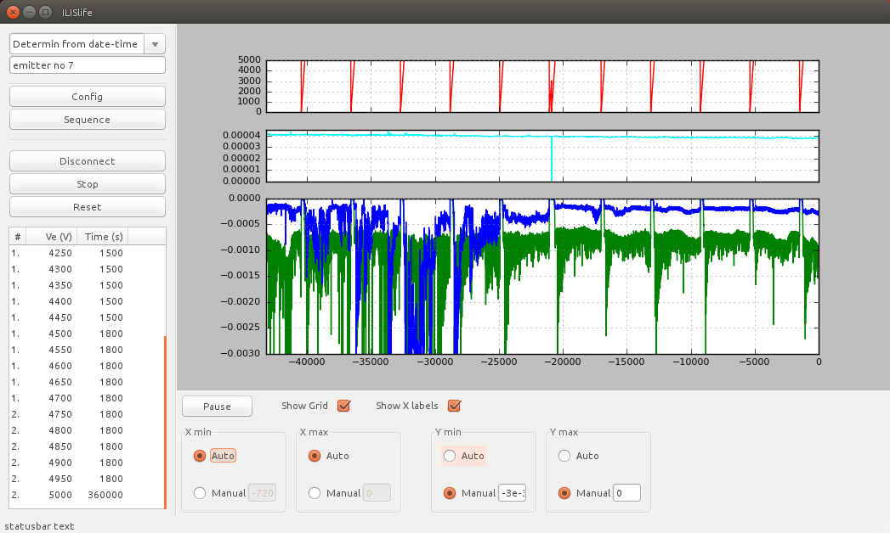

# ilislife_wxp
GUI app for measuring long-time emission current of Ionic Liquid Ion Source.
ilislife_wxp is implemented with wxpython phoenix, APScheduler, pyserial and Matplotlib.




# Setup
## On Ubuntu 16.04 LTS
Run below on your terminal.
```
sudo apt install python3-pip
sudo pip3 install --upgrade pip
sudo apt install g++ libgtk2.0-dev freeglut3-dev \
python-gst0.10-dev python3-dev libwebkitgtk-dev  libnotify-dev
sudo pip3 install --upgrade --trusted-host wxpython.org --pre -f \
http://wxpython.org/Phoenix/snapshot-builds/ wxPython_Phoenix
```
Note: Installation of wxpython phoenix takes a while (_~ 1 hour or more_ in my case) because it builds from source.
```
sudo pip3 install importlib
sudo pip3 install matploblib
sudo pip3 install pyserial
sudo pip3 install APScheduler
```

## On macOS
Install with homebrew and pip.

* If python3 is default :
```
pip install --upgrade pip
pip install --user --pre --trusted-host wxpython.org -f http://wxpython.org/Phoenix/snapshot-builds/ wxpython-phoenix
pip install importlib
pip install matploblib
pip install pyserial
pip install APScheduler
```

# How to run
Default is python2
```
python3 main.py
```
If your default python is python3, simply
```
python main.py
```

# TODO
* Bug fix: Comment func :ballot_box_with_check:
* config save and load func  :ballot_box_with_check:
* sequence save func  :ballot_box_with_check:
* Misc warnings like """Execution of job "Operation.OnSequence (trigger: interval[0:00:01], next run at: 2016-08-20 13:16:09 JST)" skipped: maximum number of running instances reached (1)
"""
* Modify for setting auto yscale to fit current displaying data in mygraph  :ballot_box_with_check:
* Labeles on Mygraph


## License
MIT
